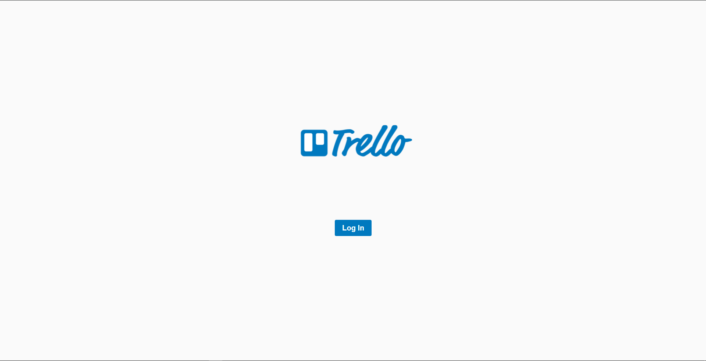
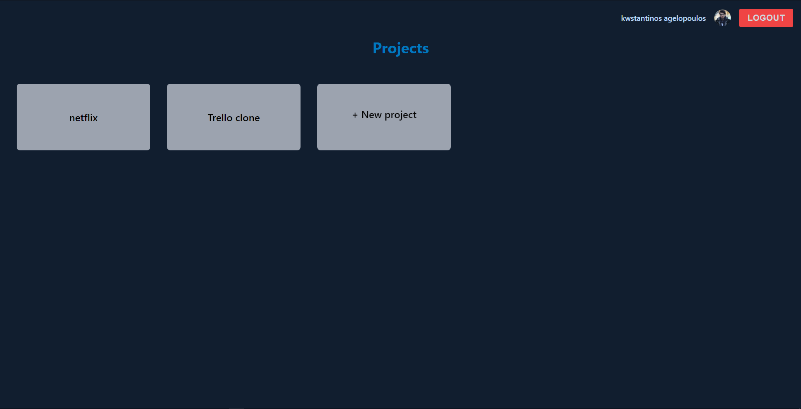

# Trello clone

A [trello clone](https://trello.com) using [ReactJS](https://reactjs.org), React Context API, React DnD, TailwindCSS, Material UI Icons & Styled Components for the frontend, Firebase for authorization, authentication and storing and Pexels for the image data.

<div align="center">
  <h1><a href="https://constantine.dev:8080/trello"> DEMO </a></h1>
</div>

## Requirements

Inside the repo there is a [.env.example file](./.env.example). Rename it to .env and fill the values with your own api keys.

For firebase you will need a firebase config file from your webapp with the following values.

```javascript
REACT_APP_FIREBASE_API_KEY=
REACT_APP_FIREBASE_AUTH_DOMAIN=
REACT_APP_FIREBASE_PROJECT_ID=
REACT_APP_FIREBASE_STORAGE_BUCKET=
REACT_APP_FIREBASE_MESSAGING_SENDER_ID=
REACT_APP_FIREBASE_APP_ID=
REACT_APP_FIREBASE_MEASUREMENT_ID=
```

For the image data you will need an API key from pexels.

```javascript
REACT_APP_PEXELS_API_KEY=
```

## Usage

Assuming you have [npm](https://www.npmjs.com) or [yarn](https://www.yarnpkg.com) installed, clone the repo and run the following code:

```bash
npm install && npm start

or

yarn install && yarn start
```

To build the .exe file for your own OS run the following code:

```bash
npm run make

or

yarn run make
```

## Examples

<br>
<p align="center">
  
  
  
</p>
